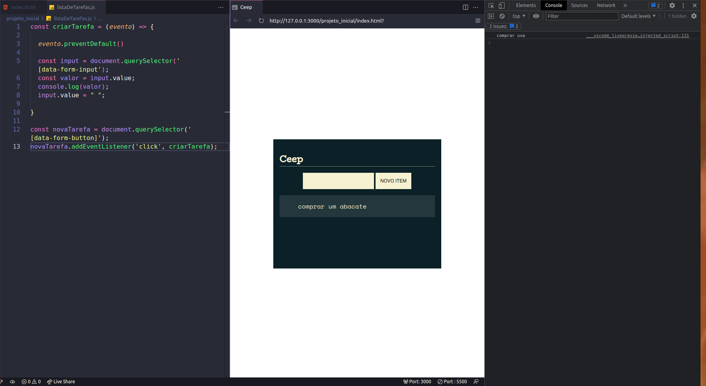

## Curso de JS na Web: Manipule o DOM com JavaScript

#### Faça esse curso de JavaScript e:
- Aprenda como funciona o DOM

- Manipule o DOM para alterar, adicionar, remover e criar novos elementos na árvore de objetos

- Trabalhe com componentização para facilitar a organização do projeto

-- Utilize o sistema de módulos do Javascript para proteger os arquivos

### 01. Conhecendo o DOM

Nesta aula, aprendemos:

- Percorrer a árvore do DOM

- Utilizar o **querySelector** para selecionar elementos da árvore do DOM

- Funcionamento da estrutura do **DOM**

### 02. Comportamento do formulário

Nesta aula, aprendemos:

- Utilizar data-attributes

- Utilizar o método addEventListener para escutar eventos no elemento

- Prevenir o comportamento padrão do formulário

